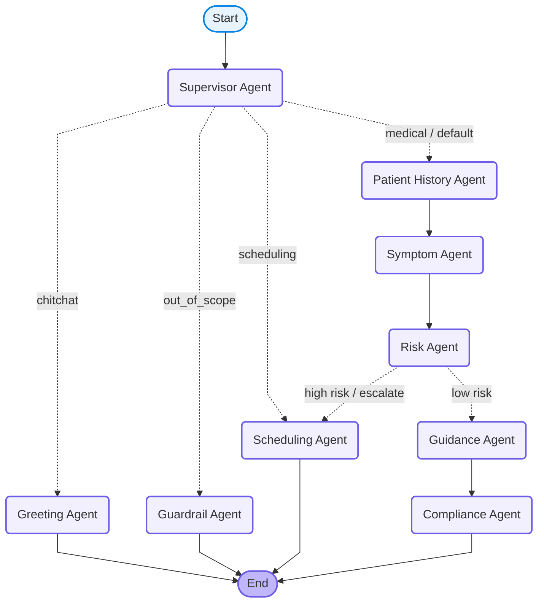

# Project Baymax - Agent Workflow Visualization

This file contains the Mermaid diagram visualizing the LangGraph workflow defined in [graph.py](file:///c:/Project_Baymax/baymax/graph.py).

## Mermaid Diagram

You can view this diagram directly on GitHub, in VS Code (with a Mermaid preview extension), or by copying it into the [Mermaid Live Editor](https://mermaid.live).



## Workflow Explanation

1. **Supervisor Agent**: The entry point of the graph. It classifies the user input's intent:
   - **`chitchat`**: Routes to the **Greeting Agent**.
   - **`out_of_scope`**: Routes to the **Guardrail Agent**.
   - **`scheduling`**: Routes directly to the **Scheduling Agent**.
   - **`medical / default`**: Routes to the medical triage flow starting with the **Patient History Agent**.

2. **Triage Flow**:
   - **Patient History Agent**: Retrieves patient medical history via the MCP Database Server.
   - **Symptom Agent**: Parses the user's input into a structured format containing symptom name, severity, and duration.
   - **Risk Agent**: Analyzes symptoms and history to check if the condition is high risk.
     - **High Risk**: Triggers conditional routing to bypass guidance and go straight to the **Scheduling Agent** for immediate appointment scheduling.
     - **Low/Moderate Risk**: Routes to the **Guidance Agent**.

3. **Guidance Flow**:
   - **Guidance Agent**: Suggests safe self-care advice or non-emergency remedies.
   - **Compliance Agent**: Appends the mandatory medical disclaimer and routes to `END`.

4. **Terminal States**:
   - **Scheduling Agent**, **Greeting Agent**, and **Guardrail Agent** execute their respective actions and route directly to `END`.

## Programmatic Visualization

If you want to generate the Mermaid code or visualize it dynamically in Python, you can use the built-in visualization utilities of LangGraph:

### 1. Print Mermaid Code
Run this command in your terminal to print the raw Mermaid flow:
```bash
uv run python -c "from baymax.graph import build_graph; print(build_graph().get_graph().draw_mermaid())"
```

### 2. Save Diagram as PNG
If you have `pygraphviz` or `graphviz` installed on your machine, you can save the diagram directly to a PNG file using:
```python
from baymax.graph import build_graph

app = build_graph()
# Note: This requires pygraphviz or similar graph visualization libraries
try:
    with open("workflow.png", "wb") as f:
        f.write(app.get_graph().draw_mermaid_png())
    print("Workflow diagram saved to workflow.png")
except Exception as e:
    print(f"Could not generate PNG: {e}")
```
