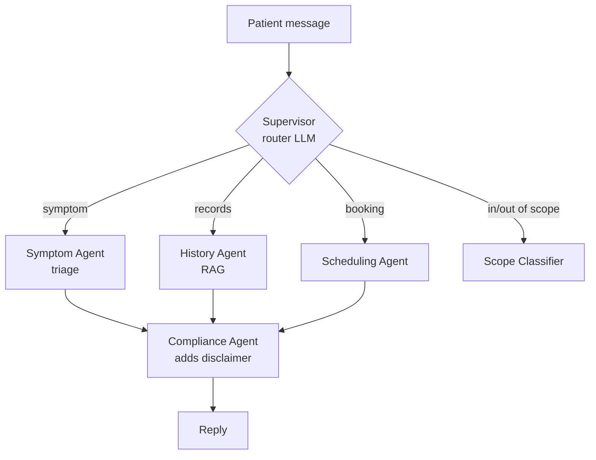
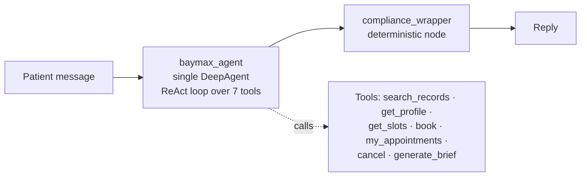

# From Multi-Agent to a Single DeepAgent

*Why Baymax started as a hub-and-spoke multi-agent system, what went wrong, and why one DeepAgent
turned out to be the better fit — with the nuance of when multi-agent is still the right call.*

---

## 1. What we originally planned

The first design was a classic **supervisor / hub-and-spoke multi-agent** graph. A supervisor LLM
read each message and *routed* it to a specialist:



On paper this looks clean: separation of concerns, each agent "specialised." In practice it was
the wrong shape for this problem.

---

## 2. What went wrong

**a) The supervisor mis-routed and hallucinated.**
Routing is itself an LLM judgement. A message like *"my head hurts, and did my last blood test
show anything?"* is simultaneously a symptom **and** a records query. A single router had to pick
one lane, and it frequently picked wrong or invented a route — so the wrong specialist answered.

**b) Several "agents" weren't really agents.**
- The **Compliance Agent** did exactly one deterministic thing: append a medical disclaimer.
- The **Scope Classifier** did one binary thing: in-scope vs out-of-scope.

Wrapping trivial, deterministic logic in a full LLM call is pure cost: latency, tokens, and a new
place to hallucinate — with no upside. These never needed to "reason."

**c) Latency stacked up.**
Every hop is a **sequential** network round-trip to the model (NVIDIA-hosted Llama 3.1 70B). A
single turn could be:

```
supervisor route call  →  specialist call  →  (maybe re-route)  →  compliance call
   ~1 LLM call              ~1–3 LLM calls        ~1 LLM call         ~1 LLM call
```

That's easily **4–6 sequential LLM calls** before the user sees a word — and they can't be
parallelised, because each depends on the previous one's output. The user feels the sum of all of
them. *(Illustrative, not a benchmark — the old version has since been replaced.)*

**d) It was hard to debug and keep in sync.**
State had to be handed between agents, prompts drifted apart, and a bad answer meant asking "which
agent, and was it even the right one?" More moving parts, more failure surface.

---

## 3. What we switched to

A **single DeepAgent** (`deepagents.create_deep_agent`) running one **ReAct tool-calling loop**,
inside a tiny 2-node LangGraph:



Key moves:
- **One agent, one context, one system prompt.** It decides *within a single reasoning loop*
  whether to search records, check the profile, or book a slot — and can do several in one turn
  (e.g. profile + records for a symptom). No router to guess the lane.
- **Compliance became a plain code node** (`compliance_wrapper`) — deterministic disclaimer, no
  LLM. Guaranteed to run, costs nothing, can't hallucinate.
- **Scope became a prompt rule**, not an agent — the system prompt tells it to decline
  out-of-scope requests.

**Files:** graph in `baymax/graph.py`; the agent + compliance node in `baymax/nodes.py`; tools in
`baymax/tools.py`.

---

## 4. Why this is better *here*

| Dimension | Multi-agent (before) | Single DeepAgent (now) |
|---|---|---|
| LLM round-trips per turn | ~4–6 sequential | 1 loop (extra calls only when a tool is actually needed) |
| Routing errors | Supervisor could mis-route | No routing step to get wrong |
| Mixed-intent messages | Forced into one lane | Handled naturally in one context |
| Trivial steps (disclaimer, scope) | Full LLM agents | Deterministic node / prompt rule |
| Debuggability | State passed across agents | One transcript, one place to look |
| Latency | Sum of all hops | Dominated by one loop |

The headline win is **latency + correctness at the same time**: fewer sequential model calls, and
no router to send the message to the wrong specialist.

---

## 5. The nuance (important talking point)

**This is not "multi-agent bad, single-agent good."** The real lesson is **match the structure to
the problem, and don't promote trivial steps to agents.**

- **DeepAgents itself supports sub-agents.** Choosing one DeepAgent didn't throw away multi-agent
  — the framework still offers it when warranted.
- **When a sub-agent *is* worth it:** a bounded, tool-heavy task whose intermediate chatter you
  want to **isolate** from the main context — e.g. a "research the patient's history" sub-agent
  that runs several searches and returns *one clean summary*, keeping the main loop's context
  small. That's context isolation earning its keep.
- **When it's *not*:** anything deterministic (disclaimer → node), a simple classification (scope
  → prompt rule), or a step that just adds a hop without isolating meaningful work.

For Baymax today the single agent wins; the door to *principled* sub-agents (History/RAG,
Scheduling) stays open and is tracked as future work.

---

## 6. Workshop talking points
- "Every agent boundary is a sequential LLM call the user waits on — add them deliberately."
- "Routing is a decision an LLM can get wrong; removing the router removed a whole error class."
- "If a step is deterministic, it's a **node**, not an agent. If it's a rule, it's a **prompt
  line**, not an agent."
- Show a **LangSmith trace** of one turn: the ReAct loop calling `get_patient_profile` +
  `search_patient_records` for a symptom — one context, visible tool calls.
- End on the nuance: "We kept the *option* of sub-agents; we just stopped paying for hops we
  didn't need."
