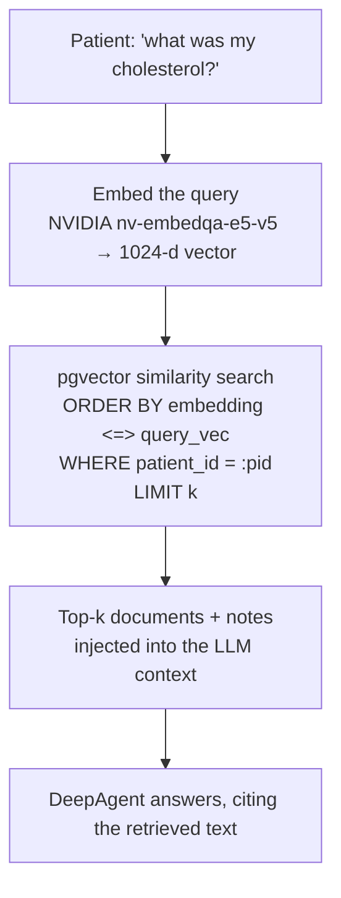

# RAG with Supabase + pgvector (and where Auth fits next)

*How Baymax grounds its answers in each patient's real records, why we use Supabase + pgvector,
and how the same platform unlocks the next features — authentication, per-patient data isolation,
and file storage.*

---

## 1. Why RAG at all

An LLM on its own will confidently make up a cholesterol value. **Retrieval-Augmented Generation
(RAG)** fixes that: before answering, we **retrieve the patient's actual documents/notes** and put
them in the model's context, so answers are grounded in real data — and we can tell the model
*"only cite what the tools return."*

In Baymax this powers: *"What did my last blood test say?"*, symptom triage that considers past
visits, and the doctor brief.

---

## 2. The data model (Supabase Postgres + pgvector)

`pgvector` is a Postgres extension that adds a `vector` column type and similarity search. Because
it lives **inside Postgres**, we store relational data and embeddings in **one database** — no
separate vector store to run or sync.

```
patients(patient_id, name, age, past_conditions[], allergies[], current_medications[])
patient_documents(id, patient_id, document_type, content_text, embedding vector(1024), created_at)
patient_interactions(patient_id, interaction_date, notes, embedding vector(1024))
hospital_slots(slot_id, slot_datetime, doctor_name, is_booked, booked_patient_id, calendar_event_id)
```

- **`embedding vector(1024)`** — 1024 dimensions because we embed with NVIDIA's
  **`nv-embedqa-e5-v5`** model, which outputs 1024-d vectors.
- **HNSW index** (`vector_cosine_ops`) on each embedding column — approximate-nearest-neighbour
  index so similarity search stays fast as data grows.

**Files:** `db/supabase_schema.sql`, `db/migration_patient_documents.sql`, `db/migration_slots.sql`;
DB access in `database_mcp_server.py`.

---

## 3. How a query flows (retrieval)



The core SQL (simplified from `database_mcp_server.py`):

```sql
SELECT content_text, created_at
FROM patient_documents
WHERE patient_id = %s              -- scope to THIS patient
  AND embedding IS NOT NULL
ORDER BY embedding <=> %s::vector  -- <=> = cosine distance (smaller = more similar)
LIMIT %s;
```

Two things to call out in the demo:
- **`<=>` is cosine distance** — the query embedding is compared to every stored embedding and the
  closest ones come back first.
- **`WHERE patient_id = …` scopes retrieval per patient** — Patient A's search never ranks Patient
  B's rows. (Today that filter is enforced in the query; §5 shows how Row-Level Security makes the
  *database itself* guarantee it.)

The agent reaches this through its `search_patient_records` tool (`baymax/tools.py`) → the MCP
server (`database_mcp_server.py`) → Supabase.

**Design choice for the demo:** Baymax runs retrieval **on every chat query** rather than caching
or pre-deciding when it's "needed." That's deliberate — it keeps the flow simple and makes the RAG
step easy to *show*. In production you'd gate retrieval (only when the message needs records) and
cache embeddings; we traded a little efficiency for clarity. *(Latency work is tracked separately.)*

---

## 4. Why Supabase specifically
- **One managed Postgres** for relational + vector data → less infrastructure.
- **pgvector + HNSW** built in → real similarity search without a bespoke vector DB.
- **A platform, not just a DB:** Auth, Row-Level Security, Storage, Realtime, and Edge Functions
  all sit on the same project — so the features below are *additions*, not new systems.

---

## 5. What Supabase unlocks next (roadmap)

> **Current state (be honest in the talk):** Baymax has **no authentication yet** — the client
> sends a `patient_id` and a `role` string that the server trusts. RLS is *enabled* on the tables
> but has *no policies*, so it isn't enforcing anything yet. The items below are the planned path.

### 5a. Authentication (Supabase Auth)
Supabase Auth issues a signed **JWT** on login (email/OTP, or SSO). The frontend then sends that
token instead of a self-declared identity. The backend verifies it and **derives** the
`patient_id` and role from the token's claims — the client can no longer just *claim* to be someone
else.

This maps directly onto Baymax's **dual role** (Patient vs Hospital Employee): store the role in
the user's `app_metadata` (server-controlled, unlike `user_metadata`) and read it from the verified
JWT to gate staff-only actions (document upload, doctor brief).

### 5b. Row-Level Security (per-patient isolation, enforced by the DB)
With Auth in place, RLS policies make Postgres itself refuse cross-patient access — defense in
depth even if app code has a bug:

```sql
-- A patient can only read their own documents
CREATE POLICY patient_reads_own ON patient_documents
  FOR SELECT USING (patient_id = auth.jwt() ->> 'patient_id');
-- (staff get a broader policy keyed off the role claim)
```

This turns the `WHERE patient_id = …` convention from §3 into a **guarantee**: the database
returns no other patient's rows regardless of what the query asks for.

### 5c. Storage & more
- **Supabase Storage** for the actual PDF files (today we extract text and embed it; Storage would
  keep the original document, with access controlled by the same auth).
- **Realtime / Edge Functions** are available on the same project if we later want live updates or
  server-side hooks.

---

## 6. Workshop talking points
- "RAG = don't trust the model's memory; retrieve the patient's real data and make it cite that."
- "pgvector means our vectors live *in Postgres* — one database for records **and** similarity
  search."
- "`<=>` is cosine distance; `ORDER BY embedding <=> query LIMIT k` *is* the retrieval."
- "We run RAG every turn on purpose — it's simpler to teach; production would gate + cache it."
- "Auth isn't bolted on later from a different vendor — Supabase Auth + RLS live on the same DB,
  so identity and per-patient isolation drop straight into what we already have."
